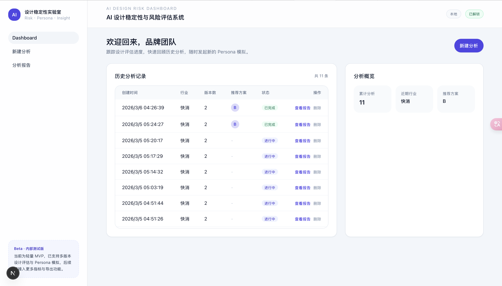
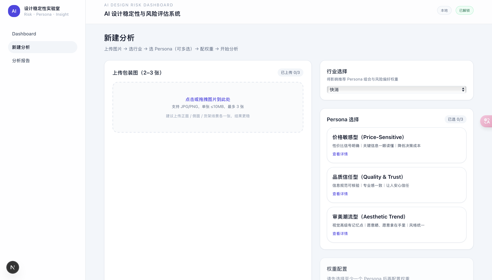
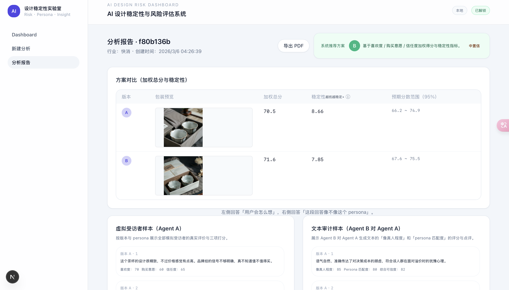

# AI 设计稳定性与风险评估系统 (MVP)  

一个面向 **B2B 设计评审 / 版本对比** 的 AI Dashboard：上传 2–3 个设计版本，选择行业 + Persona + 权重，一键生成“虚拟受访者反馈 + 文本审计”，并输出版本对比（加权总分 / 稳定性 / 置信区间）。  
A demo-ready AI dashboard for **B2B design review & variant comparison**: upload 2–3 design variants, choose industry + persona + weights, and generate simulated consumer feedback + audit results with summary comparisons.

---

## Demo / 演示
- Repo: https://github.com/jiayi-jin/ai-risk-dashboard-mvp  
- Live demo (optional): `<Vercel link if available>`  
- Short demo video/GIF (recommended): `docs/demo.gif`

---

## What it does / 核心功能
**Dashboard**
- 历史运行记录 + 一键新建分析  
- View run history + create a new analysis

**New Analysis**
- 上传图片（2–3 张版本对比，最多 3 张）  
- 选择行业 / Persona（固定 3 个模板）  
- 权重配置（喜欢度 / 购买意愿 / 信任度，总和=100）  
- Upload 2–3 images, pick industry/persona, set weighted scoring, and start analysis

**Report**
- 版本对比：加权总分、稳定性（标准差）、95% 区间  
- 抽样展示：  
  - Agent A (GPT)：以 Persona 口吻给出真实评价 + 0–100 分  
  - Agent B (Gemini)：审计 A 的“像真人程度 / Persona 匹配度 / 具体性”  
- Variant comparison + sampled outputs from Agent A and audit from Agent B

---

## Screenshots / 截图
> 建议把截图放到 `docs/screenshots/`  
- `docs/screenshots/dashboard.png`  
- `docs/screenshots/new.png`  
- `docs/screenshots/report.png`

  
  


---

## Why it’s credible / 为什么结果更可信（MVP 版本）
- **配置可追溯**：行业 / Persona / 权重 / 模型选择与输出 JSON 都可回看  
- **对比友好**：同一配置下比较多个版本，减少“随便跑一次”的偶然性  
- **审计机制**：B 端对 A 的“像真人/一致性”进行检查（若不可用可降级）  
- Traceable configs + consistent comparison + audit mechanism

> 后续可扩展：扰动性/鲁棒性测试、多轮采样、惩罚机制等。  
> Future work: robustness tests, multi-run sampling, penalties, etc.

---

## Tech Stack / 技术栈
- Next.js (App Router)
- Supabase (Postgres + Storage)
- OpenAI (Agent A)
- Gemini (Agent B)

---

## Quickstart (Local) / 本地运行
### 1) Install
```bash
npm i
